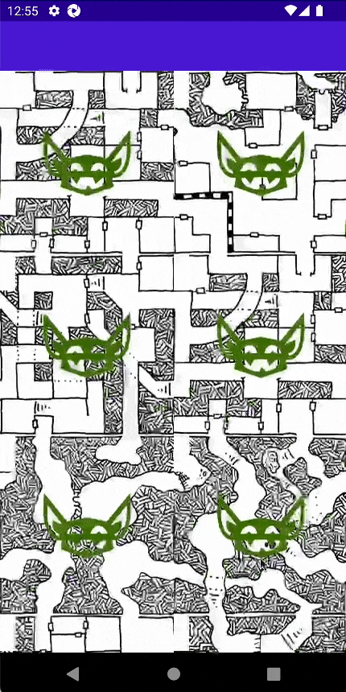

# EncounterApp
A simple infinite scrolling d&d dungeon app to highlight some dotnet maui features and best practices. 

## Concept
infinite scrolling dungeon. each tile has 1 level 1 monster. tapping the tile will show the monster stat block. checkbox to defeat monster. icon will change from full color to b&w monster after defeat.
|  | |
| -- | -- |
| | |

## architecture and feature highlights
- rest api architecture
	- resilient
		- retry
		- circuit breaker
		- caching - configurable per request pattern. currently only one caching policy
	- parsing
		- deserialization to objects strategy
		- request/response classes with no additional properties or methods
- service oriented architecture/Direct Injection
	- dependencies are constructor injected as needed
- general/misc
	- input validation: validate input and throw relevant exceptions
	- typed string sources to prevent typos (ex: `$"{nameof(MapTilePage)}"`  not `"MapTilePage"`)
- MVVM UI
	- xaml
		- data binding
		- ui value converters (ex: bool to string resource uri to toggle image based on binding)
		- multibinding: string format data binding
	- infinite scrolling collectionview: new data is fetched on demand just in time
- unit testing
	- dependencies injected to allow for unit testing
		- RandomSeed injected to provide deterministic scenarios in test
		- HttpMessageHandler injected to test rest services without real api calls
		- Policy.NoOpAsync() so services are tested without retry/cache
	- mock protected
- UI Test/Integration testing
	- automate full app deployment to test specific app use scenarios